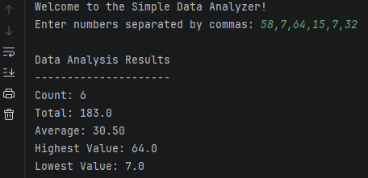

# Simple Data Analyzer

A Python program that analyzes a set of user-entered numbers and provides summary statistics such as count, total, average, highest value, and lowest value.

## Program Screenshot



## Features

- Accepts user-entered numeric data
- Calculates total of all values
- Calculates average
- Finds the highest value
- Finds the lowest value
- Displays the total number of values entered
- Includes input validation

## Technologies Used

- Python

## Project Structure

```text
simple-data-analyzer/
├── simple_data_analyzer.py        # Main program
├── README.md                      # Project documentation
└── data-analyzer-screenshot.png   # Example output
```

## How to Run

1. Download the file
2. Run the program in Python

```bash
python simple_data_analyzer.py
```

## Example Use

The program asks the user to enter numbers separated by commas, such as:

```text
10, 25, 7, 42, 18
```

It then calculates and displays:
- Count
- Total
- Average
- Highest value
- Lowest value

## Learning Objectives

This project demonstrates:
- Python functions
- List handling
- Numeric calculations
- Input validation
- Basic data analysis concepts

## Author
Anthony Bowser Jr  
Computer Science Student  
Southern New Hampshire University
